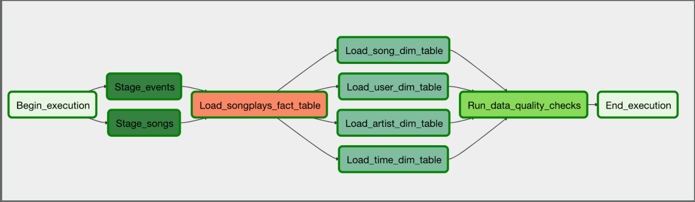

# Project 5: Data Pipelines with Airflow
-------------------------

## Purpose

Sparkify, a music streaming service, wants to leverage Apache Airflow to automate and monitor its data warehouse ETL workflows. Our goal is to create high-quality data pipelines that are dynamic and made up of reusable activities, can be monitored, and are simple to backfill. After the ETL procedures are completed, we want to run tests against the dataset to catch any differences.

The source data is in S3 and needs to be processed in Sparkify's data warehouse in Amazon Redshift. The source data are CSV logs containing user activity in the application and JSON metadata about the songs the users listen to. 

## Airflow Tasks

We will create custom operators to perform tasks such as staging the data, filling the data warehouse and running checks. The tasks will need to be linked together to achieve a coherent and sensible data flow within the pipeline. 

## Datasets

The log data is located at `s3://udacity-dend/log_data` and the song data is located in `s3://udacity-dend/song_data`.

## Project Template

- There are three major components of the project:
1. Dag template with all imports and task templates.
2. Operators folder with operator templates.
3. Helper class with SQL transformations.
- Add `default parameters` to the Dag template as follows:
    * Dag does not have dependencies on past runs
    * On failure, tasks are retried 3 times
    * Retries happen every 5 minutes
    * Catchup is turned off
    * Do not email on retry
- The task dependencies should generate the following graph view:

- There are four operators:
1. Stage operator 
    * Loads JSON and CSV files from S3 to Amazon Redshift
    * Creates and runs a `SQL COPY` statement based on the parameters provided
    * Parameters should specify where in S3 file resides and the target table
    * Parameters should distinguish between JSON and CSV files
    * Contain a templated field that allows it to load timestamped files from S3 based on the execution time and run backfills
2. Fact and Dimension Operators
    * Use SQL helper class to run data transformations
    * Take as input a SQL statement and target database to run query against
    * Define a target table that will contain results of the transformation
    * Dimension loads are often done with truncate-insert pattern where target table is emptied before the load
    * Fact tables are usually so massive that they should only allow append type functionality
3. Data Quality Operator
    * Run checks on the data
    * Receives one or more SQL based test cases along with the expected results and executes the tests
    * Test result and expected results are checked and if there is no match, operator should raise an exception and the task should retry and fail eventually

## Build Instructions

Run `/opt/airflow.start.sh` to start the Airflow server. Access the Airflow UI by clicking `Access Airflow` button. Note that Airflow can take up to 10 minutes to create the connection due to the size of the files in S3. 
